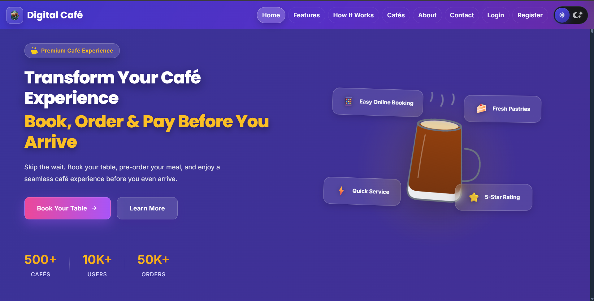
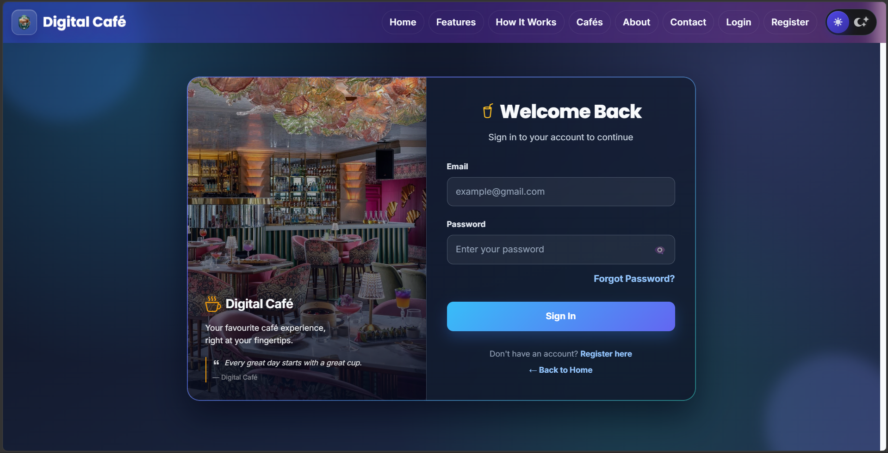
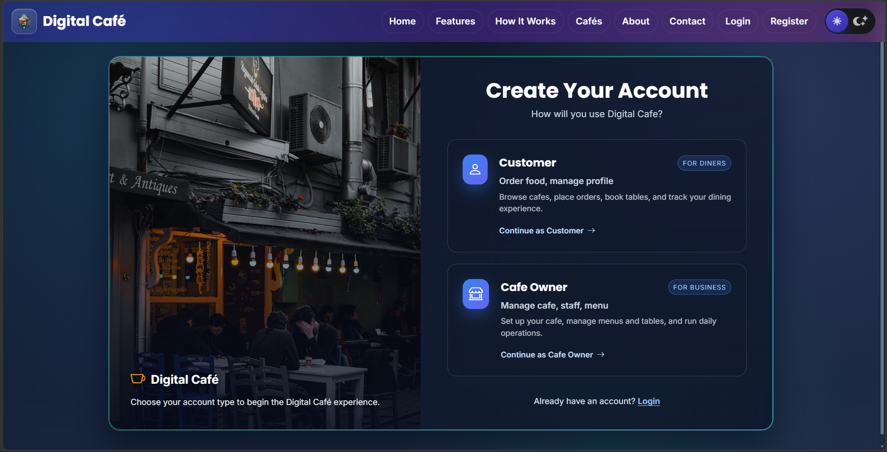
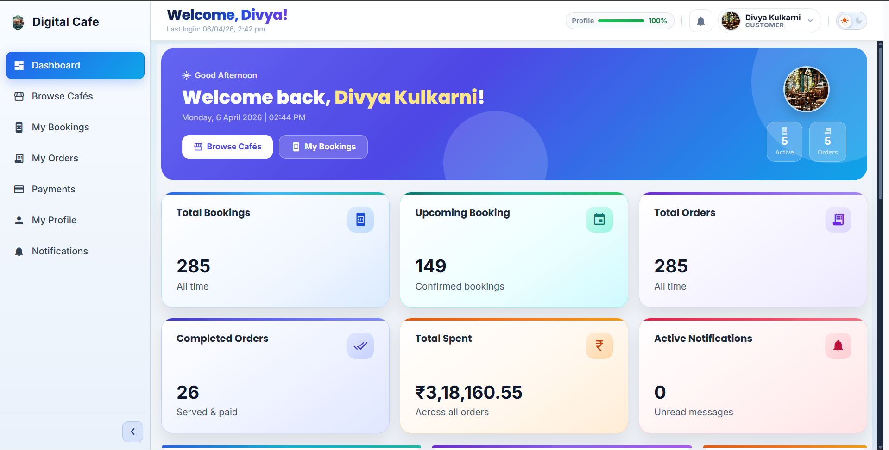
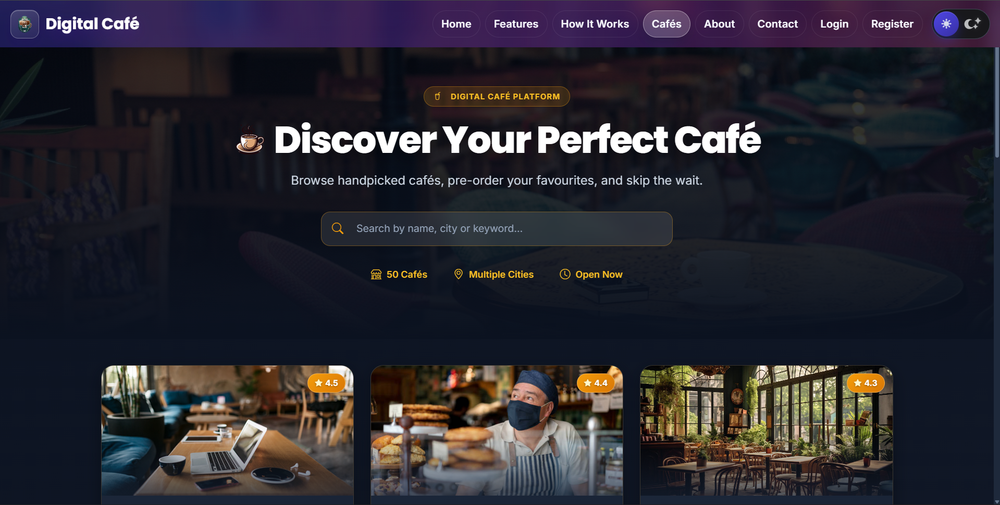
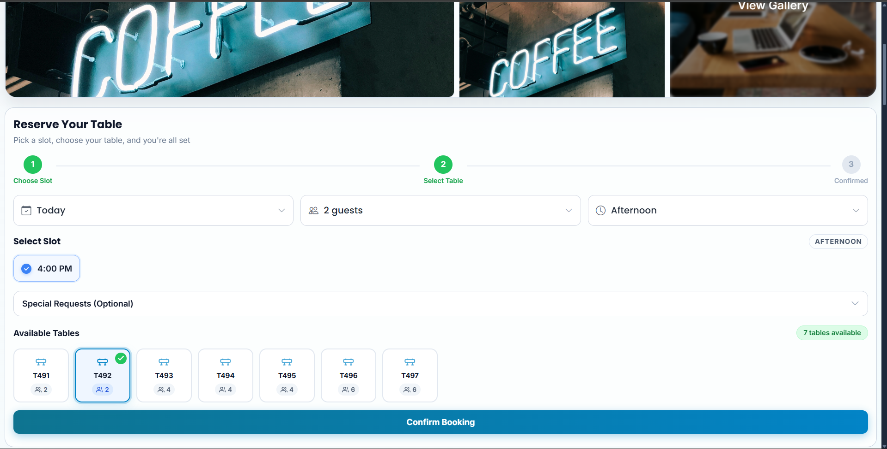
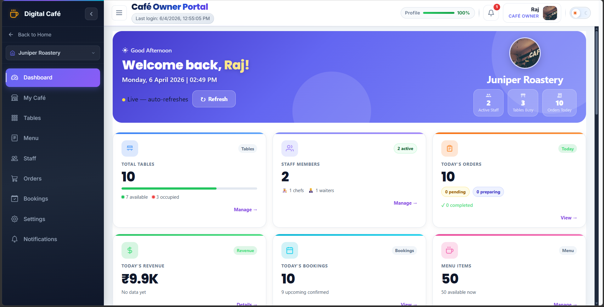
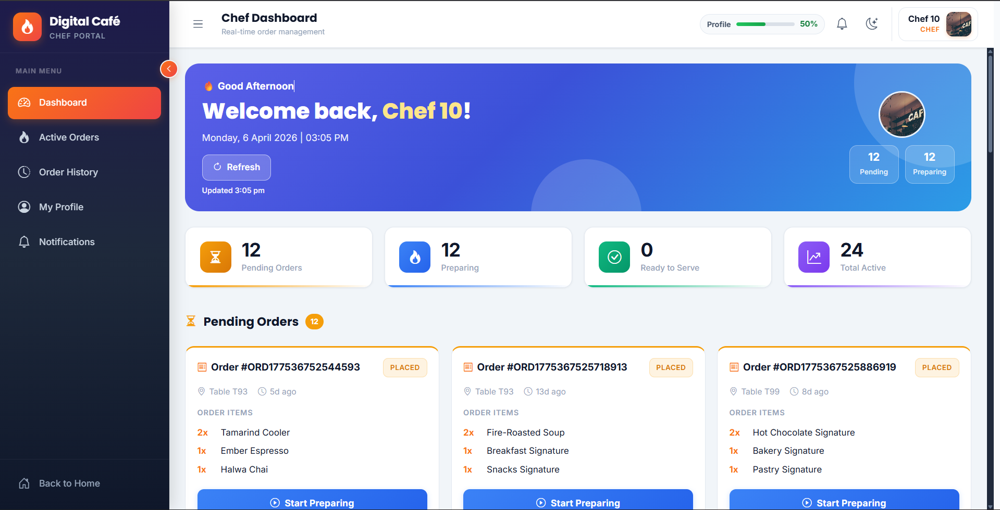
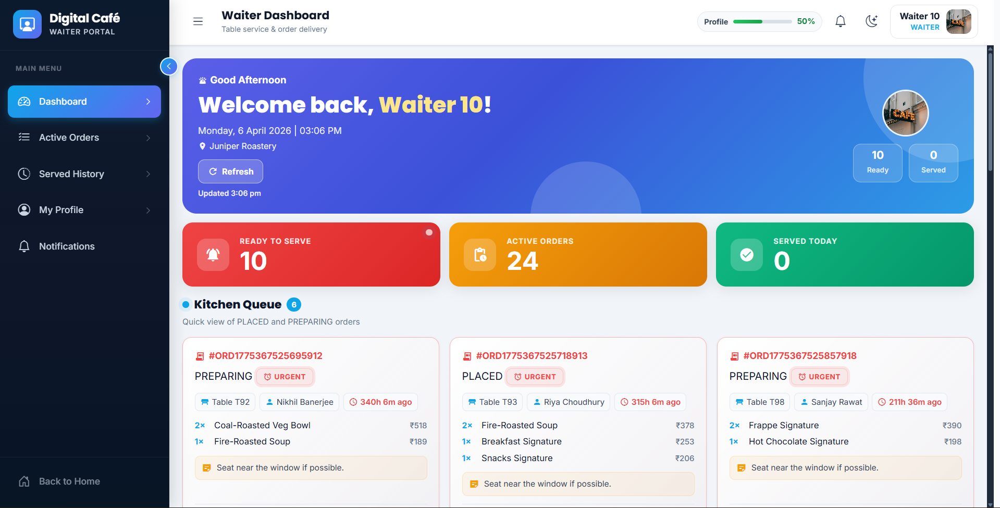
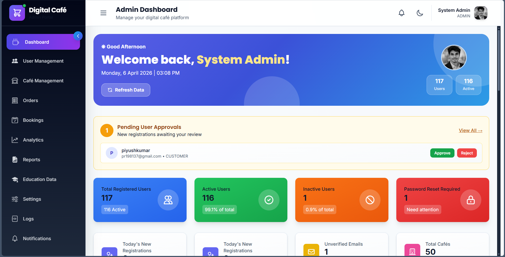

<div align="center">

# ☕ Digital Café Ordering and Operations Platform

**A full-stack cafe management system with real-time order tracking, online payments, and multi-role dashboards**

[](https://openjdk.org/)
[](https://spring.io/projects/spring-boot)
[](https://angular.io/)
[](https://www.mysql.com/)
[](https://razorpay.com/)
[](https://aws.amazon.com/)
[](LICENSE)

</div>

---

## 📖 About

Digital Café is an enterprise-grade platform that digitizes the complete café journey, from table booking and menu browsing to order placement and Razorpay payments.  
It supports **5 distinct roles** with dedicated dashboards and real-time WebSocket updates, and is deployment-ready on AWS.

## 🔗 Live Links

- Frontend: https://cafehub.tech
- Backend API: https://api.cafehub.tech/api
- API Docs (Swagger): https://api.cafehub.tech/swagger-ui.html

## 📌 Problem Statement

Cafes often run on manual processes for table booking and order handling.
This creates long wait times, order errors, and poor visibility for staff.

## ✅ Solution Overview

This platform digitizes the complete cafe flow:

- Customers can browse menus, book tables, place orders, and pay online.
- Kitchen and service staff get real-time updates.
- Owners and admins get control dashboards and operational visibility.

## ✨ Key Features (Role-Based)

### Customer

- Browse cafes and menus
- Table booking with slot checks
- Place order and track status in real time
- Online payment integration

### Cafe Owner

- Manage cafe profile, menu, tables, and staff
- View and monitor cafe-level orders

### Chef

- Live order queue
- Status updates: `PENDING -> PREPARING -> READY`

### Waiter

- Ready-order pickup queue
- Status update: `READY -> SERVED`

### Admin

- User and cafe owner management
- Platform-level oversight and analytics

## 🛠️ Tech Stack

### Backend

- Java 21
- Spring Boot
- Spring Security + JWT
- Spring Data JPA (Hibernate)
- Spring WebSocket (STOMP)
- MySQL

### Frontend

- Angular
- TypeScript
- PrimeNG / Tailwind CSS
- RxJS

### DevOps / Infrastructure

- Docker + Docker Compose
- Nginx reverse proxy
- AWS (EC2, RDS, S3-ready setup)
- GitHub Actions CI/CD

## 🧠 System Architecture

```text
[Angular SPA]
   |
   | HTTPS + JWT + WebSocket
   v
[Nginx Reverse Proxy]
   |
   +--> [Spring Boot API]
            |
            +--> [MySQL]
            +--> [S3/Local Storage]
            +--> [SMTP / Payment Provider]
```

Architecture style:

- Layered monolith (`Controller -> Service -> Repository`)
- Clear separation of concerns for maintainability
- Real-time events via WebSocket for staff dashboards

Why this is production-friendly:

- Fast delivery with clean boundaries
- Easy to monitor, debug, and deploy
- Good foundation for future service split if scale grows

## 🧩 Design Decisions (With Reasoning)

- JWT-based stateless auth: scales horizontally without server session storage.
- DTO pattern: protects entity model and keeps API contracts stable.
- Role-based authorization: strict access control by business role.
- Centralized exception handling: consistent API error responses.
- WebSocket for status updates: avoids expensive polling and improves UX.

## 🗄️ Database Design (Scalability Thinking)

Core entities include:

- users, roles, user_roles
- cafes, cafe_tables, menu_items
- bookings
- orders, order_items, payments
- profile-related tables

Scalability considerations:

- Normalized schema to reduce duplication
- Foreign keys for data integrity
- Index-ready query patterns for high-read endpoints
- Can add read replicas and caching (Redis) as traffic grows

## 📡 API Overview

Representative endpoints:

| Method | Endpoint                  | Purpose              |
| ------ | ------------------------- | -------------------- |
| POST   | `/api/auth/login`         | Authenticate user    |
| GET    | `/api/cafes/active`       | Public cafe listing  |
| POST   | `/api/bookings`           | Create table booking |
| POST   | `/api/orders`             | Create order         |
| PUT    | `/api/orders/{id}/ready`  | Chef marks ready     |
| PUT    | `/api/orders/{id}/served` | Waiter marks served  |
| POST   | `/api/payments/initiate`  | Start payment        |
| POST   | `/api/payments/verify`    | Verify payment       |

Full docs: `Swagger UI` link above.

## 🖼️ Screenshots

| Screen               | Preview                                                        |
| -------------------- | -------------------------------------------------------------- |
| Landing Page         |            |
| Login                |                            |
| Register             |                      |
| Customer Dashboard   |  |
| Cafes Listing        |                    |
| Menu                 |                              |
| Table Booking        |            |
| Cafe Owner Dashboard |        |
| Chef Dashboard       |          |
| Waiter Dashboard     |      |
| Admin Dashboard      |        |

## 📁 Project Structure

```text
Digital-Cafe-Ordering-and-Operations-Platform/
├── digital-cafe-backend/
│   ├── src/main/java/com/digitalcafe/
│   │   ├── config/
│   │   ├── controller/
│   │   ├── dto/
│   │   ├── entity/
│   │   ├── repository/
│   │   └── service/
│   └── src/main/resources/
├── digital-cafe-frontend/
│   └── src/app/
│       ├── core/
│       ├── features/
│       └── shared/
├── infra/
│   ├── compose/
│   ├── scripts/
│   └── nginx/
└── docs/
```

## ⚙️ Setup Instructions

### 1. Clone Repository

```bash
git clone https://github.com/Piyush-Kumar62/Digital-Cafe-Ordering-and-Operations-Platform.git
cd Digital-Cafe-Ordering-and-Operations-Platform
```

### 2. Configure Environment

Use env files for backend runs in `digital-cafe-backend/env`:

- `digital-cafe-backend/env/.env.dev` for local development (`SPRING_PROFILES_ACTIVE=dev`)
- `digital-cafe-backend/env/.env.prod` for production (`SPRING_PROFILES_ACTIVE=prod`)
- `digital-cafe-backend/env/.env.local` for optional local machine overrides

### 3. Run Backend

```bash
cd digital-cafe-backend
./mvnw spring-boot:run
```

Backend default: `http://localhost:8080`

For profile-specific runs:

```bash
# Dev
cd digital-cafe-backend
SPRING_PROFILES_ACTIVE=dev ./mvnw spring-boot:run

# Prod
cd digital-cafe-backend
SPRING_PROFILES_ACTIVE=prod ./mvnw spring-boot:run
```

IDE notes (IntelliJ + VS Code):

- Open/run the `digital-cafe-backend` module.
- Set `SPRING_PROFILES_ACTIVE` to `dev` or `prod` in Run Configuration.
- If `digital-cafe-backend/env/.env.dev` or `digital-cafe-backend/env/.env.prod` is missing, backend now falls back to safe defaults so startup still works.

### 4. Run Frontend

```bash
cd ../digital-cafe-frontend
npm install
npm start
```

Frontend default: `http://localhost:4200`

## 🚀 Deployment (AWS + Docker + Nginx)

Production flow:

- Build backend and frontend Docker images
- Push images to container registry
- Deploy on AWS EC2 using Docker Compose
- Nginx handles reverse proxy and HTTPS termination
- MySQL hosted on AWS RDS (recommended)
- Static/media files can use S3

Useful files:

- `infra/compose/docker-compose.prod.yml`
- `infra/scripts/deploy.sh`
- `infra/scripts/render-env-from-ssm.sh`
- `.github/workflows/ci-cd.yml`
- `docs/aws-deployment-guide.md` (Phase 0 -> Phase 8 runbook)
- `docs/prod-values-checklist.md` (ready-to-fill production values)

## 🔐 Security Implementation

- JWT access and refresh token strategy
- Password hashing (BCrypt)
- Role-based authorization at API level
- CORS configuration for trusted frontend domains
- Environment-based secret management
- Production proxy setup with Nginx

## 📈 Future Enhancements

- Redis caching for high-traffic read endpoints
- OpenTelemetry metrics and tracing
- Rate limiting and abuse protection improvements
- Event-driven modules for scale-out
- Mobile app client (Flutter/React Native)

## 👨‍💻 Author

**Piyush Kumar**

- GitHub: https://github.com/Piyush-Kumar62
- LinkedIn: https://linkedin.com/in/your-linkedin

---
