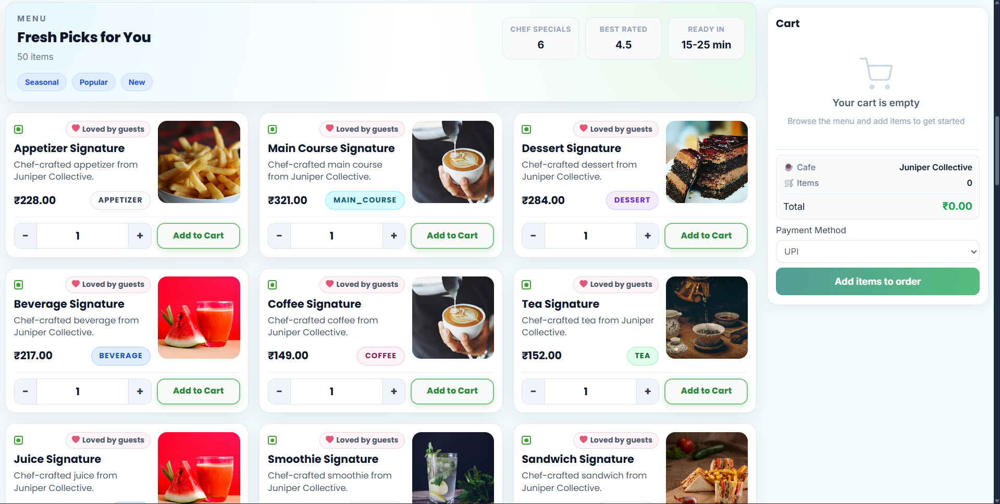

# Digital Café Ordering and Operations Platform

A comprehensive full-stack application for managing café operations with user registration, authentication, and role-based access control.

## 🚀 Features

- **Multi-step Registration Process**: Complete 5-step user registration wizard
- **JWT Authentication**: Secure token-based authentication system
- **Role-based Access**: Admin, Café Owner, Chef, Waiter, Customer roles
- **Email Verification**: Gmail SMTP integration for email notifications
- **Responsive Design**: Mobile-friendly registration and login forms
- **MySQL Database**: Persistent data storage with JPA/Hibernate

## 🛠️ Technology Stack

### Backend

- **Spring Boot 3.5.10** - Main framework
- **Spring Security** - Authentication & authorization
- **Spring Data JPA** - Database operations
- **MySQL 8.0** - Database
- **JWT** - Token-based authentication
- **Gmail SMTP** - Email service

### Frontend

- **Angular 20** - UI framework
- **TypeScript** - Programming language
- **SCSS** - Styling
- **Tailwind CSS** - Utility-first CSS framework
- **Reactive Forms** - Form management

## 🔧 Quick Setup

### Prerequisites

- Java 21+
- Node.js 18+
- MySQL 8.0+

### Backend Setup

```bash
cd digital-cafe-backend
./mvnw spring-boot:run
# Runs on http://localhost:8080
```

### Frontend Setup

```bash
cd digital-cafe-frontend
npm install
npm start
# Runs on http://localhost:4200
```

### Database Configuration

Update `application.properties`:

```properties
spring.datasource.username=your_mysql_username
spring.datasource.password=your_mysql_password
spring.mail.username=your_gmail_address
spring.mail.password=your_gmail_app_password
```

## 🎯 Registration Flow

1. **Basic Info** - Email, username, password
2. **Personal Details** - Name, DOB, gender, contact
3. **Address** - Complete address information
4. **Academic** - Education qualifications
5. **Work Experience** - Professional background

## 🔐 API Endpoints

- `POST /api/auth/simple-register` - Quick registration
- `POST /api/auth/register` - Comprehensive registration
- `POST /api/auth/login` - User login
- `GET /api/auth/verify-email` - Email verification

## 📧 Email Setup

1. Enable 2FA on Gmail
2. Generate app password
3. Update email config in `application.properties`

## 🗃️ Database

Uses MySQL with JPA auto-generation. Tables include:

- `users` - Authentication
- `profiles` - Personal info
- `addresses` - Location details
- `academic_info` - Education
- `work_experiences` - Employment history

## 🎨 Responsive Design

Mobile-first design with breakpoints at 768px and 480px for optimal user experience across all devices.

## 📝 License

MIT License - see LICENSE file for details.

---

**Happy Coding! ☕️**

### Landing Page


### Menu Page



### Admin Dashboard


---

## 🤝 Contributing

Contributions are welcome! Please follow these steps:

1. **Fork the repository**
2. **Create a feature branch**
   ```bash
   git checkout -b feature/amazing-feature
   ```
3. **Commit your changes**
   ```bash
   git commit -m "Add amazing feature"
   ```
4. **Push to the branch**
   ```bash
   git push origin feature/amazing-feature
   ```
5. **Open a Pull Request**

### Code Style

- **Java:** Follow Google Java Style Guide
- **TypeScript:** Follow Angular Style Guide
- **Comments:** Write clear, concise comments
- **Testing:** Add unit tests for new features

---

## 🐛 Known Issues

- Email verification feature requires SMTP configuration
- Payment gateway integration is pending
- Real-time notifications need WebSocket implementation

---

## 📝 License

This project is licensed under the MIT License - see the [LICENSE](LICENSE) file for details.

---

## 👥 Authors

- **Piyush Kumar** - [@Piyush-Kumar62](https://github.com/Piyush-Kumar62)

---

## 🙏 Acknowledgments

- [Spring Boot](https://spring.io/projects/spring-boot) - Backend framework
- [Angular](https://angular.io/) - Frontend framework
- [Delicious Template](https://bootstrapmade.com/delicious-free-restaurant-bootstrap-theme/) - UI design
- [Bootstrap](https://getbootstrap.com/) - CSS framework

---

## 📞 Support

For support, email piyushkumar30066@gmail.com or create an issue in this repository.

---

## 🔗 Links

- **Repository:** https://github.com/Piyush-Kumar62/Digital-Cafe-Ordering-and-Operations-Platform
- **Issues:** https://github.com/Piyush-Kumar62/Digital-Cafe-Ordering-and-Operations-Platform/issues

---

**⭐ If you found this project helpful, please give it a star!**
